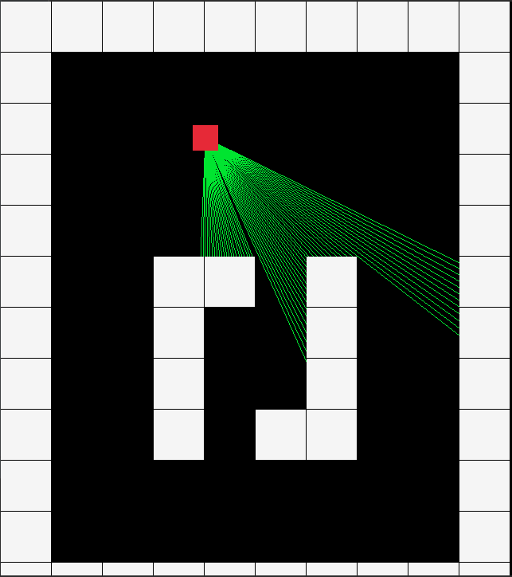

# Raycast & BRDF Project

This repository holds the code to an example implementation of raycasting and BRDF lighting models. It has been created for Assignment 2 of Computer Graphics (2023).

## Team Members

- Calin Clement O'Ceallaigh
- Annan Sang
